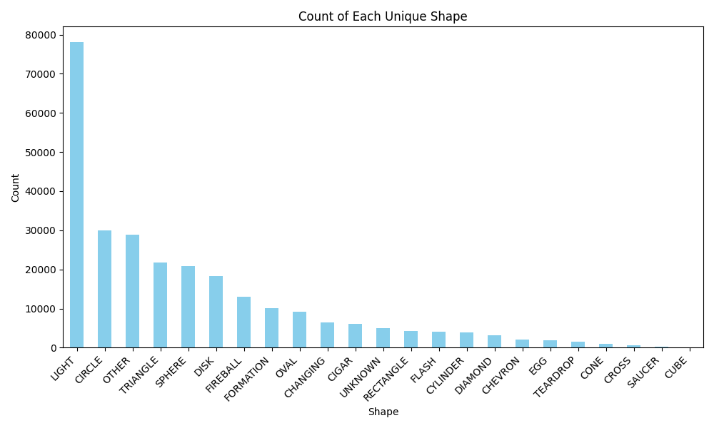
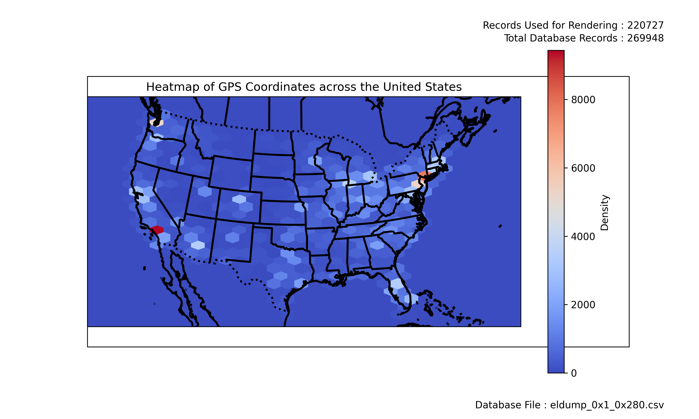

# Enigmalabs UFO/UAP Database Tools

Author Crazyvoid - Randall Perkins 02/01/2024

https://twitter.com/CrazyVoidPS4

This repository contains a set of tools designed to facilitate the extraction, processing, and visualization of UFO/UAP sighting data from the Enigmalabs database. The tools are aimed at researchers and enthusiasts interested in exploring and analyzing this intriguing phenomenon.

### Warning some of these scripts are msssy and incomplete. So please understand going forward. and feel free to contribute!

## Tool Overview

### elRipper.py
The `elRipper.py` script serves as the core scraper tool, allowing users to extract UFO/UAP sighting reports from Enigmalabs. It downloads the reports as original HTML files, providing a comprehensive dataset for further analysis.

**Usage:** `python elRipper.py <start_number> <end_number> <output_dir>`

- `<start_number>`: The starting report number for scraping.
- `<end_number>`: The final report number to scrape.
- `<output_dir>`: The directory where the HTML files will be saved.

### elHtml2Csv.py
The `elHtml2Csv.py` script converts the downloaded HTML files into a structured CSV database, enabling easy data manipulation and analysis.

**Usage:** `python elHtml2Csv.py <input_dump_dir> <output_csv_file>`

- `<input_dump_dir>`: The directory containing the downloaded HTML files.
- `<output_csv_file>`: The path to the output CSV file.

### elMergeCsvFiles.py
The `elMergeCsvFiles.py` script merges multiple CSV databases into a single, coherent dataset. It ensures that the data is ordered and indexed correctly for comprehensive analysis.

**Usage:** `python elMergeCsvFiles.py <first_input_csv> <second_input_csv> <merged_output_csv>`

- `<first_input_csv>`: The path to the first input CSV file.
- `<second_input_csv>`: The path to the second input CSV file.
- `<merged_output_csv>`: The path to the merged output CSV file.

### elChart_OverallUniqueCraftShapes.py
The `elChart_OverallUniqueCraftShapes.py` script generates a chart illustrating the overall distribution of unique craft shapes reported in the database.

**Usage:** `python elRipper.py <input_csv_file> <output_chart_image>`

- `<input_csv_file>`: The input CSV file containing the data.
- `<output_chart_image>`: The path to the output chart image file.

### elChart_USAHeatMap.py
The `elChart_USAHeatMap.py` script creates a heatmap visualizing UFO/UAP sightings across the United States. It offers various customization options for tailoring the heatmap to specific needs.
some features of this script might be imcomplete or not function as expected

**Usage:** `python elChart_USAHeatMap.py <csv_file> --output_png <output_png>`

**Arguments:**
- `<csv_file>`: The path to the CSV file containing GPS coordinates and other data.
- `--output_png`: The path to the output PNG file for the heatmap.
- `--start_date`: Optional start date for filtering CSV data (format: YYYY-MM-DD).
- `--end_date`: Optional end date for filtering CSV data (format: YYYY-MM-DD).
- `--specific_shape`: Optional shape filter for narrowing down the dataset.
- `--grid_size`: Optional grid size for the heatmap (larger values result in smaller dots).
- `--cmap`: Optional colormap mode for the heatmap.
- `--outline_color`: Optional color for geographical outlines on the heatmap.

These tools provide a comprehensive toolkit for extracting, processing, and visualizing UFO/UAP sighting data from the Enigmalabs database. Whether you're a researcher, enthusiast, or data analyst, these tools offer valuable insights into this intriguing phenomenon.

